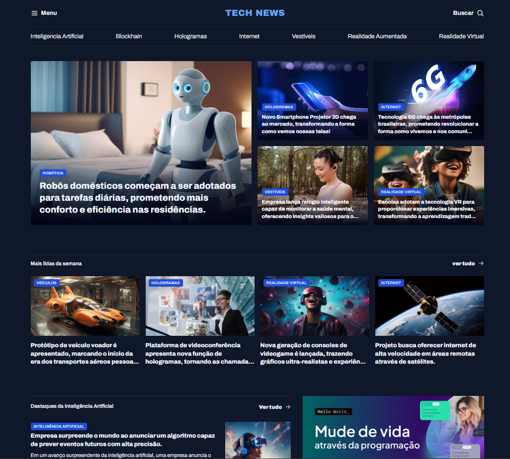

# Projeto - Portal de Notícias

🚀 Um repositório destinado para o projeto Travelgram da jornada do curso **Full-Stack** da Rocketseat, ministrado pelo Mayk Brito. ⚒

> Formação Full-Stack: [Nível 4] Avançando no HTML e CSS

O projeto desenvolvido, foi para a exploração do conceito de GRID, prezando também pela organização dos arquivos, no qual construimos um site de notícias de tecnologias, 

[🔗 Veja o projeto](https://fesette.github.io/)

## 🛠️ Tecnologias

- HTML
- CSS
- Git e Github